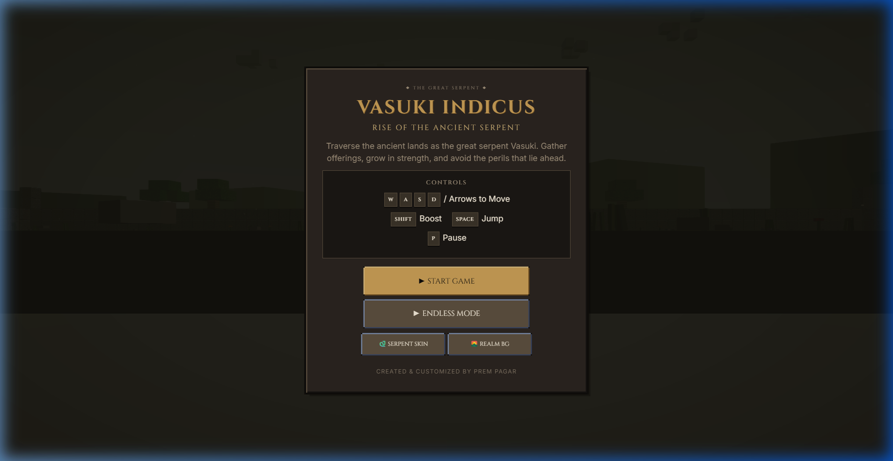
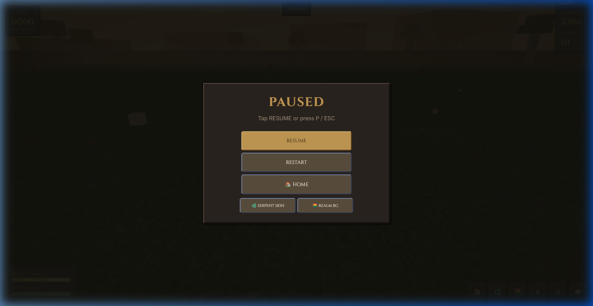
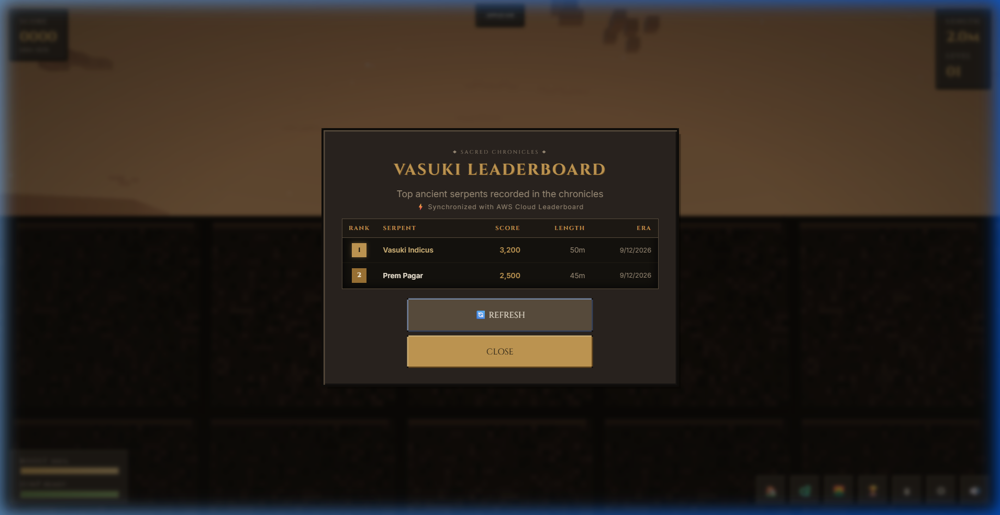

# Weekend Deployment Challenge: VASUKI INDICUS — Ancient 3D Voxel Serpent on AWS Serverless

**Tag**: `#deployment` `#aws-amplify` `#serverless` `#dynamodb` `#aws-community`


When people think of the classic arcade snake game, they usually picture flat 2D green pixels crawling across a retro grid. When I set out to build my project for the **AWS Weekend Deployment Challenge**, I wanted to take that timeless nostalgic mechanic and reinvent it entirely: moving into real-time 3D voxel graphics, grounding it in ancient heritage aesthetics inspired by the legendary prehistoric serpent *Vasuki Indicus*, and backing it with an enterprise-grade, serverless cloud leaderboard running 100% on the **AWS Free Tier**.

Here is the story of how **VASUKI INDICUS** came together, how I engineered the decoupled architecture between client and cloud, the bugs that taught me the most, and what this deployment weekend showed me about the power of modern serverless infrastructure.

---

## What Your App Does



**VASUKI INDICUS** is a fast-paced 3D arcade web game where players navigate ancient lands as the mythical prehistoric serpent. The goal is simple in concept, but intense in practice: gather ancient offerings, grow longer with every collection, manage high-speed turns, jump across obstacles, and preserve your score against terrain boundaries and your own tail.

### The Problem It Solves
Most casual browser games are either completely disconnected silos (where your high score disappears the moment you close the tab or refresh), or they require tedious sign-ups, passwords, and oauth forms just to record a 3-minute arcade run. Furthermore, many WebGL games struggle with heavy bundle sizes, slow cold-load times on cheap hosting, or bloated advertising trackers.

VASUKI INDICUS solves this by offering:
- **Zero-Friction Access**: Players simply open the link and play immediately—no account creation, no cookies, no tracking.
- **Global Serverless High Scores**: Scores are automatically inscribed onto a global cloud leaderboard backed by Amazon DynamoDB, visible to players worldwide in real time.
- **Graceful Offline Resilience**: If a player loses connection or is on a spotty mobile network, the game never crashes or freezes; an intelligent client-side fallback system saves scores locally and automatically recovers when connectivity resumes.
- **Ancient Aesthetic & Customization**: Players can choose between custom serpent skins (Bronze Relic, Golden Nagavanshi, Charcoal Obsidian, Emerald Forest) and shift atmospheric realms (Sacred Night, Dusk Ember, Dawn Mist).



---

## How You Built It

The game frontend is built using **HTML5, CSS3, and JavaScript (ES6 Modules)** powered by the **Three.js** 3D WebGL engine. I chose vanilla JavaScript with native ES Modules over heavy frontend frameworks like Next.js or React because I wanted zero build overhead, instant startup times, and direct 60 FPS access to the WebGL render loop.

### 1. 3D Voxel Kinematics & Custom Shaders
Each segment of the serpent is composed of procedurally textured voxel blocks with distinct joint physics. As the serpent turns, each subsequent block smoothly interpolates along the previous segment's path, creating a serpentine slither. To complement the ancient stone and bronze motif, I wrote custom fragment shaders for soft glow halos around collectibles and dynamic particle systems for ambient dust and fireflies.

### 2. The Input Shield & Event Propagation Bug
One of the most elusive bugs I hit during development happened on the Game Over screen. When a player died and tried to type their name into the leaderboard submission input field, pressing the letter **"R"** (the game restart shortcut) or **Spacebar** (the boost shortcut) instantly triggered the game loop in the background, erasing their name and throwing them back into a new game!

To solve this, I built an event isolation barrier:
```javascript
// Prevent game shortcut keys from triggering while typing player name
const activeEl = document.activeElement;
const isInputFocused = activeEl && (activeEl.tagName === 'INPUT' || activeEl.tagName === 'TEXTAREA');
if (isInputFocused) {
    return; // Shield keyboard events from game engine
}
```
This taught me an important lesson about decoupled UI state versus game loops: always establish strict input barriers between modal forms and canvas event listeners.

### 3. Non-Blocking Async Network Calls
In a high-speed arcade game, network latency can never block the main animation frame. I structured `LeaderboardService.js` to execute completely asynchronously using native `fetch()` promises. When the player clicks "Inscribe Name", the UI renders an immediate local optimistic update while the POST payload fires in the background.



---

## AWS Services Used / Architecture Overview

I wanted an architecture that was scalable, secure, highly available, and free-tier friendly. Here is how the pieces connect:

```
[ Player Web Browser ]
         │
         │  1. HTTPS Web Delivery (Amazon CloudFront CDN)
         ▼
[ AWS Amplify Hosting ]
         │
         │  2. REST API Calls (GET/POST /leaderboard)
         ▼
[ Amazon API Gateway (HTTP API v2) ]
         │
         │  3. Event Payload Proxy with CORS
         ▼
[ AWS Lambda (Node.js 20.x Handler) ]
         │
         │  4. Least-Privilege IAM Execution Role
         ▼
[ Amazon DynamoDB (VasukiLeaderboard Table) ]
```

### Breakdown of Services

1. **AWS Amplify Hosting**: 
   - Hosts the client application with continuous deployment connected directly to the GitHub repository `main` branch.
   - Automatically provides global Amazon CloudFront CDN edge caching and SSL/TLS encryption. Every `git push` triggers an automated deployment in under 60 seconds.
2. **Amazon API Gateway (HTTP API v2)**:
   - Provides lightweight, low-latency REST endpoints for `/leaderboard`.
   - Handles CORS preflight `OPTIONS` requests and enforces clean payload passing without needing heavy API Gateway v1 proxy setups.
3. **AWS Lambda (Node.js 20.x)**:
   - Executes the serverless business logic for validating scores, sanitizing player names, and querying high scores.
   - Runs in less than 20 milliseconds per invocation, consuming minimal memory (256 MB allocation).
4. **Amazon DynamoDB**:
   - Stores all leaderboard records in the `VasukiLeaderboard` table using On-Demand (PAY_PER_REQUEST) billing.
   - Key Schema:
     - Partition Key: `gameId` (String: `"VASUKI_INDICUS"`)
     - Sort Key: `score` (Number, descending)
   - Enables blazing-fast index queries to fetch the Top 10 scores in single-digit milliseconds.
5. **AWS SAM (Serverless Application Model)**:
   - The entire backend is defined as Infrastructure as Code in `aws/template.yaml`, allowing anyone to reproduce and deploy the backend with a single command (`sam deploy`).

---

## What You Learned

Participating in the Weekend Deployment Challenge pushed me out of my comfort zone and gave me hands-on insights:

- **AWS Amplify is Incredibly Frictionless**: Going from a local Git repository to a globally distributed web application with automated continuous delivery took less than two minutes. The automated CloudFront integration eliminated manual bucket policies and certificate management.
- **Decoupled Architecture Yields Reliability**: Keeping the client application static on Amplify while running the API on Lambda and DynamoDB meant that backend updates or cold starts never affected page load speeds or game rendering.
- **Security-by-Design on the Client**: Building the client without a single AWS credential or access key in the browser code was a top priority. Relying strictly on IAM execution roles within Lambda proved how clean serverless security can be.
- **Designing for Offline First**: Network requests fail—especially on mobile devices. Designing a fallback mechanism where the game falls back to local storage caching ensured the user experience never broke, even before the cloud API was wired up.

---

## Links & Live Demo

- **Live Game (AWS Amplify)**: [https://main.d12d9hurljxv4f.amplifyapp.com/](https://main.d12d9hurljxv4f.amplifyapp.com/)
- **Live Game (GitHub Pages)**: [https://premxpagar.github.io/vasuki-indicus-game/](https://premxpagar.github.io/vasuki-indicus-game/)
- **Public GitHub Repository**: [https://github.com/premxpagar/vasuki-indicus-game](https://github.com/premxpagar/vasuki-indicus-game)

---

*Thank you to AWS Builder Center for organizing the Deploy Your First App Weekend Challenge! Building and deploying VASUKI INDICUS this weekend has been an unforgettable experience.*
